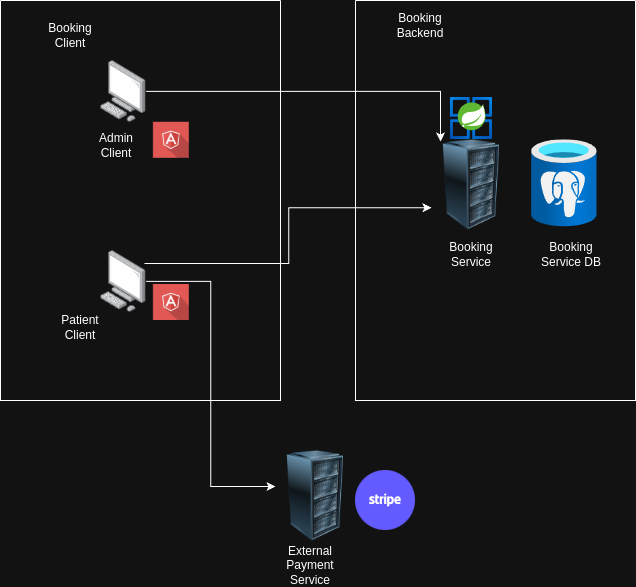
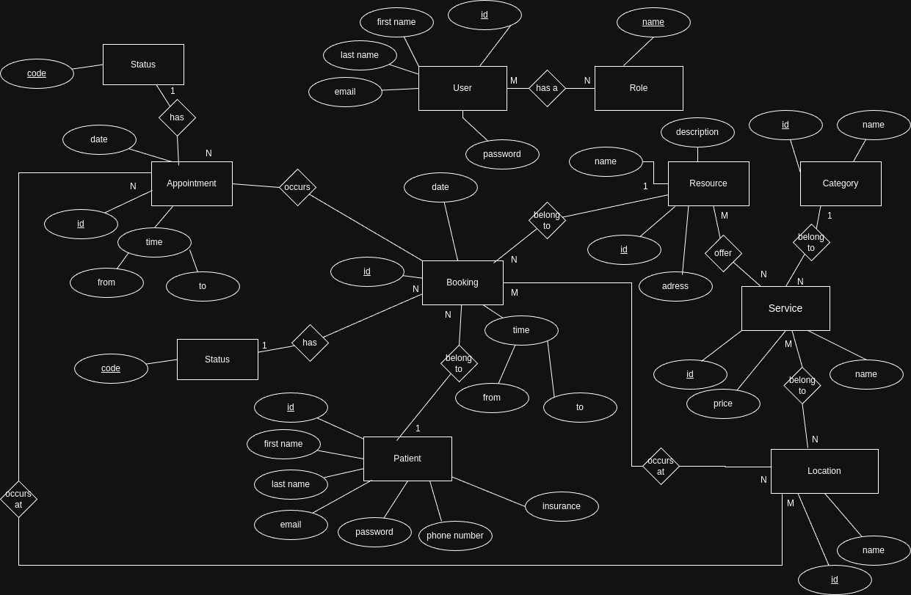

# System Diagram

### This project consist of Front End app made with Angular v19 and Backend app made with Spring Boot 3.41 and Postgres Database

# ER Diagram

## Entities and Attributes

### 1. **User**
- **id** (UUID): Unique identifier for the user.
- **first_name** (String): First name of the user.
- **last_name** (String): Last name of the user.
- **email** (String): Email address of the user.
- **password** (String): Password for authentication.
- **Relationships**:
  - Each user has a **Role**.

### 2. **Role**
- **id** (UUID): Unique identifier for the role.
- **name** (String): Role name (e.g., Admin, Patient, etc.).

### 3. **Patient**
- **id** (UUID): Unique identifier for the patient.
- **first_name** (String): First name of the patient.
- **last_name** (String): Last name of the patient.
- **email** (String): Email address of the patient.
- **password** (String): Password for authentication.
- **phone_number** (String): Contact number of the patient.
- **insurance** (String): Insurance details of the patient.
- **Relationships**:
  - A patient books **Appointments**.
  - A patient can have an **AppointmentStatus**.

### 4. **Appointment**
- **id** (UUID): Unique identifier for the appointment.
- **date** (Date): Date of the appointment.
- **time_from** (Time): Start time of the appointment.
- **time_to** (Time): End time of the appointment.
- **Relationships**:
  - An appointment belongs to a **Patient**.
  - An appointment is associated with a **Booking**.
  - An appointment has an **AppointmentStatus**.
  - An appointment is for a **Resource**.

### 5. **AppointmentStatus**
- Possible values:
  - AVAILABLE
  - BOOKED
  - CANCELED

### 6. **Booking**
- **id** (UUID): Unique identifier for the booking.
- **date** (Date): Date of the booking.
- **time_from** (Time): Start time of the booking.
- **time_to** (Time): End time of the booking.
- **Relationships**:
  - A booking belongs to an **Appointment**.
  - A booking occurs on a specific **Date**.
  - A booking has a **BookingStatus**.

### 7. **BookingStatus**
- Possible values:
  - CREATED
  - IN_PROGRESS
  - BOOKED
  - CANCELED
  - REALIZED

### 8. **Resource** (Dentist, Denthal Surgeon, Orthodonist etc)
- **id** (UUID): Unique identifier for the resource.
- **name** (String): Name of the resource.
- **description** (String): Description of the resource.
- **address** (String): Address where the resource is located.
- **Relationships**:
  - A resource is used for an **Appointment**.
  - A resource occurs at a **Location**.
  - A resource offers a **Service**.

### 9. **Service**
- **id** (UUID): Unique identifier for the service.
- **name** (String): Name of the service.
- **price** (Decimal): Price of the service.
- **Relationships**:
  - A service belongs to a **Category**.
  - A service is available at a **Location**.
  - A service is offered by a **Resource**.

### 10. **Location**
- **id** (UUID): Unique identifier for the location.
- **name** (String): Name of the location.
- **Relationships**:
  - A location is where **Resources** occur.
  - A location offers **Services**.

### 11. **Category** (primary dental care, dental implant surgery etc)
- **id** (UUID): Unique identifier for the category.
- **name** (String): Name of the category.
- **Relationships**:
  - A category groups **Services**.

## Relationships Overview
- **User** has a **Role**.
- **Patient** books **Appointments**.
- **Appointments** are associated with **Resources**.
- **Resources** offer **Services**.
- **Services** belong to **Categories**.
- **Bookings** are linked to **Appointments**.
- **Appointments** have **AppointmentStatus**.
- **Bookings** have **BookingStatus**.
- **Resources** are available at **Locations**.
